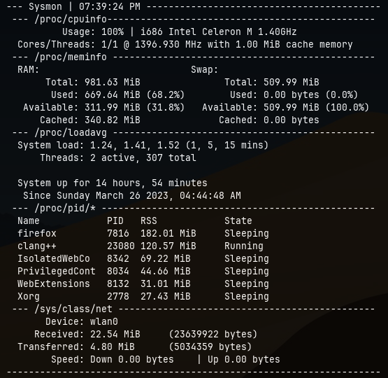

# SysMon, a system monitor aiming to be fast and ready to use

using [**curses**](https://docs.python.org/3/howto/curses.html)

rewrite sysmon


old sysmon


## what is sysmon
sysmon is *another* system monitor designed to be **ready to use** and easy to understand. it uses [**linux's /proc pseudo filesystem**](https://www.kernel.org/doc/html/latest/filesystems/proc.html) to read information and [**curses**](https://docs.python.org/3/howto/curses.html) to display them

## why 2 files?
because i like the old layout too of sysmon. theres also the cpu temp feature which is not in new sysmon. i strongly suggest you to use the new sysmon, because of better code

## help and usage
```
sysmon - a SYStem MONitor written in python, designed to be easy to understand
         and "ready to use", with only ONE dependecy: curses

Usage: sysmon ARG which can be: cpuinfo, meminfo, loadavg, net, and statvfs
                                or bl ARG1 ARGX
 Explanation:
     - cpuinfo: cpu information such as model, cores & threads, and freq
     - meminfo: memory and swap information like used, total, available and
                cached
     - loadavg: load times, uptime, and threads running
     -     net: network stats, including up/down speed
     -  stavfs: mountpoint usage, like used, total and free
            To change which mountpoint to show, use "point MOUNTPOINT"
            for example: sysmon point /mnt/usb/
     -      bl: blacklist a plugin

Notes:
  - CPU frequency isnt always the same, this depends on the kernel config
  - Cached memory is part of used memory (cached - used = "actual" used)
  - Was planning to add cpu temperature, but its kinda confusing (because
   of different methods possible, which dont work on every hardware)
```
## bug/suggestion/correction
please open a issue, including traceback and a screenshot if you found a bug

if you want to suggest a new feature, or if you found something that is not correct (for example, incorrect cpu temperature or ram usage/something else) feel free to open an issue

## notes
You might **NOT** be able to view the temperature, or the temperature might **NOT** be accurate, because sysmon reads `/sys/class/thermal/thermal_zone0/temp` or `/sys/class/hwmon/hwmon1/temp1_input` to get the temperature, and your system might report it in a different file for example. If sysmon cannot read the temperature, it will display "??". **You will NOT see the temperature if you have an AMD cpu**. If you know how to fix this, please open an issue or pull request 

## credits
many thanks to [skyblueborb](https://github.com/skyblueborb) for helping me test, fix and make the cpu temperature feature better

also many thanks to [ari](https://ari-web.xyz/gh) for helping me with the padding/formatting of the text
