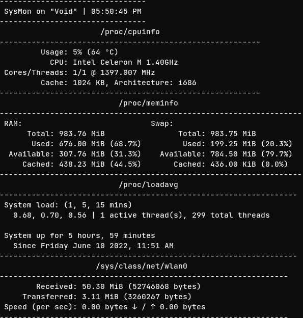

# SysMon, a system monitor aiming to be fast and ready to use

using [**curses**](https://docs.python.org/3/howto/curses.html)

## what is sysmon
sysmon is *another* system monitor designed to be **ready to use** and easy to understand. it uses [**linux's /proc pseudo filesystem**](https://www.kernel.org/doc/html/latest/filesystems/proc.html) to read information and [**curses**](https://docs.python.org/3/howto/curses.html) display them

## help and usage
By default, when running without options itll display everything, memory usage, cpu and load times\n There are 3 options: The options are:

+ mem --> RAM and swap usage
+ cpu ----> CPU information
+ load ---> Load averange and uptime of your system

If you dont want to see everything, run: `./sysmon Xcpu Xmem Xload` where X can be **ONLY** "yes" or "no"

Example: `./sysmon yescpu yesmem noload`

You can also print the options, with the "once" option

Example: `./sysmon once OPTION` which can be **ONLY** mem, cpu or load

## notes
You might **NOT** be able to view the temperature, or the temperature might **NOT** be accurate, since sysmon reads `/sys/class/thermal/thermal_zone0/temp` or `/sys/class/hwmon/hwmon1/temp1_input` to get the temperature. **You will NOT see the temperature if you have an AMD cpu**

many thanks to [skyblueborb](https://github.com/skyblueborb) for helping me test, fix and making the cpu temperature possible
