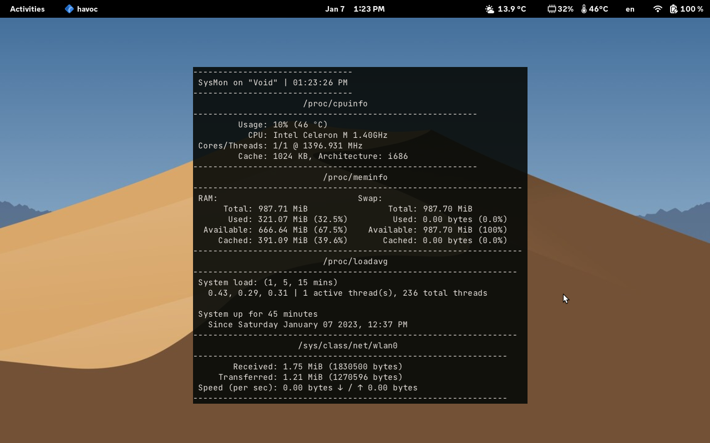

# sysmon, a system monitor ready to use

using [**curses**](https://docs.python.org/3/howto/curses.html)

# preview
## sysmon on a laptop

## sysmon on a mobile phone (with root access, because some things won't work)


# old sysmon


## try before cloning
```sh
curl https://raw.githubusercontent.com/devlocalhost/sysmon/main/sysmon | python
```

## download without cloning
```
curl https://raw.githubusercontent.com/devlocalhost/sysmon/main/sysmon -O sysmon
```

## what is sysmon
sysmon is *another* system monitor which is **ready to use** and easy to understand. it uses [**linux's /proc pseudo filesystem**](https://www.kernel.org/doc/html/latest/filesystems/proc.html) to read information and [**curses**](https://docs.python.org/3/howto/curses.html) to display them. the only thing you have to do is git clone this repo, and run the sysmon file

## why 2 files?
because i like the old layout of sysmon too (but I rarely use it). i strongly suggest you to use the new sysmon, because better code, improvements, and faster

## help and usage
```
  --nocpu          Disables cpuinfo (cpu information, like usage, model, and more)
  --nomem          ~~~~~~~~ meminfo (memory information, like total, used and more)
  --noload         ~~~~~~~~ loadavg (load times information, including uptime)
  --nopid          ~~~~~~~~ procpid (most ram/vmrss consuming pids)
  --nonet          ~~~~~~~~ network_stats (network stats, like received/transfered bytes)
  --procs INT      How many processes to show. Default: 6
  --timeout FLOAT  Refresh time. Default: 1
```
## notes
  - CPU frequency isnt always the same, this depends on the kernel config
  - CPU temperature MIGHT NOT be accurate. not my problem (unless you know a better implementation, THAT DOES **NOT USE** external libraries or programs!)
  - Cached memory is part of used memory (cached - used = will give "actual" used (?))


## bug/suggestion/correction
please open a issue, including traceback and a screenshot if you found a bug

if you want to suggest a new feature, or if you found something that is not correct (for example, incorrect cpu temperature or ram usage/something else) feel free to open an issue

## credits
many thanks to [skyblueborb](https://github.com/skyblueborb) for helping me test, fix and make the cpu temperature feature better

also many thanks to [ari](https://ari-web.xyz/gh) for helping me with the padding/formatting of the text
